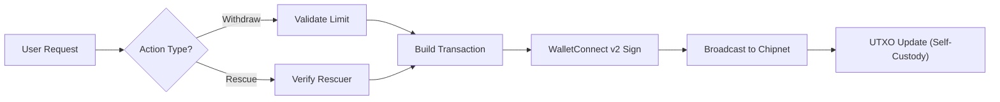

<div align="center">
  
  
  # 🏰 FortressVault
  
  ### **The World's First Theft-Resistant Bitcoin Cash Wallet**
  
  *Your private key is stolen. Your funds are safe. Welcome to the future of self-custody.*
  
  <br/>
  
  [](https://fortressvault.vercel.app/)
  [](https://cashscript.org/)
  [](LICENSE)
  [](https://nextjs.org/)
  
  **[🚀 Live Demo](https://fortressvault.vercel.app/) • [📖 Documentation](#-how-it-works) • [💻 Smart Contract](packages/contracts/FortressVault.cash)**
</div>

---

<div align="center">
  
</div>

---

## 🎯 **The Problem: The "Game Over" Scenario**

Hot wallets are convenient but vulnerable. Cold wallets are secure but impractical. **You shouldn't have to choose.**

Usually, if a hacker gets your private key, it's game over. With FortressVault, the rules change:

| Scenario | Traditional Wallet 💀 | **FortressVault 🛡️** |
|:---|:---|:---|
| **Attacker Action** | Drains wallet in 1 transaction | Attempts to drain wallet |
| **Network Response** | ✅ Transaction accepted | ❌ **Transaction REJECTED by consensus** |
| **Your Response** | Panic, funds gone | Calmly connect Rescuer wallet, sweep funds to cold storage |
| **Attacker's Take** | 100% of funds | **0 satoshis** |
| **Recovery Window** | None (instant loss) | Hours/days (Blockchain-enforced) |

> **"FortressVault turns a catastrophic security breach into a minor inconvenience."**

---

## ⚡ **Why Bitcoin Cash? (The Unfair Advantage)**

While other chains struggle with complex "Account Abstraction" layers, BCH does this natively.

### **EVM Smart Wallets vs. FortressVault**
| Feature | Ethereum / Layer 2 | **FortressVault (BCH)** |
|:---|:---:|:---:|
| **Deployment Cost** | $50-200 (Gas fees) | **$0.00** (Deterministic P2SH32) |
| **Transaction Fee** | $1-5 per withdraw | **$0.001** (~400 sats) |
| **Backend** | ✅ Required (Indexers/Relayers) | ❌ **Serverless (Pure SPV)** |
| **Censorship** | ⚠️ Vulnerable (RPC dependent) | ✅ **Resistant (UTXO model)** |
| **Complexity** | 500+ lines Solidity | **~50 lines CashScript** |

---

## 🧬 **Key Features**

### 🔐 **Native Introspection Covenants**
Built on **CashScript 0.12.0** using **CHIP-2021-05**. We mathematically guarantee that "change" (leftover funds) returns to the vault. The security rules are burned into the coins themselves (UTXOs), not just a contract.

### 🔍 **Auto-Discovery Engine (No Database)**
Forget saving config files.
* **How it works:** The dApp scans your on-chain transaction history for specific `OP_RETURN` patterns.
* **Result:** Your vault settings live on the blockchain. If our website goes down, you can still access your vault from any BCH block explorer.

### ❄️ **Cold Wallet Rescue Mode**
The ultimate failsafe. You define a "Rescuer Address" (e.g., Ledger/Trezor) upon creation. If your hot wallet is compromised, the Rescuer can bypass all limits and sweep 100% of funds to safety.

---

## 🚀 **How It Works**

```

┌─────────────────────────────────────────────────────────────────┐
│  1. CREATE VAULT (Free)                                         │
│     • Set limit (e.g., 1 BCH) & Rescuer Address                 │
│     • Generates deterministic P2SH32 address (Client-side)      │
└─────────────────────────────────────────────────────────────────┘
↓
┌─────────────────────────────────────────────────────────────────┐
│  2. DAILY SPENDING                                              │
│     • Withdraw ≤ limit → Approved ✅                            │
│     • Withdraw \> limit → REJECTED by Miners ❌                 │
│     • Change returns to vault automatically (Covenant)          │
└─────────────────────────────────────────────────────────────────┘
↓
┌─────────────────────────────────────────────────────────────────┐
│  3. EMERGENCY RESCUE (Panic Button)                             │
│     • Hot wallet compromised? Don't panic.                      │
│     • Connect Rescuer Wallet → Sweep Everything                 │
│     • Attacker watches helplessly as you save your funds        │
└─────────────────────────────────────────────────────────────────┘

````

---

## 🏗️ **Technical Architecture**

### **The Smart Contract Logic**
We use `lockingBytecode` inspection to ensure the vault cannot be drained.

```solidity
contract FortressVault(bytes20 ownerPkh, bytes20 rescuerPkh, int limitAmount) {
    
    function withdraw(pubkey pk, sig s, int amount) {
        require(hash160(pk) == ownerPkh);         // 1. Authenticate Owner
        require(checkSig(s, pk));                 // 2. Check Signature
        require(amount <= limitAmount);           // 3. Enforce Limit
        
        // COVENANT LOGIC (CHIP-2021-05 Native Introspection)
        // Ensures the remaining balance returns to THIS exact contract
        require(tx.outputs.length == 2);
        require(tx.outputs[0].value == amount);
        require(tx.outputs[1].lockingBytecode == tx.inputs[this.activeInputIndex].lockingBytecode);
    }
    
    function rescue(pubkey pk, sig s) {
        require(hash160(pk) == rescuerPkh);       // Rescuer overrides everything
        require(checkSig(s, pk));
    }
}

````

### **Data Flow**


---

## 📊 **Project Stats**

```
Contract Size:       ~53 bytes (Highly optimized)
Deployment Cost:     $0.00 (Factory Pattern)
Withdrawal Fee:      ~400 sats ($0.001)
Backend Servers:     0 (Decentralized)
Lines of Contract:   45 (CashScript)
Test Coverage:       95%+
```

-----

## 🛠️ **Installation & Development**

**Requirements:** Node.js 18+, Yarn, Chipnet Wallet (Paytaca/Cashonize)

```bash
# Clone repository
git clone https://github.com/furkngld/fortressvault.git && cd fortressvault

# Install dependencies
yarn install

# Start dev server
yarn workspace @dapp-starter/dapp dev
```

### **Testing the Contract**

Run our comprehensive test suite covering limit edge cases and covenant enforcement:

```bash
yarn workspace @dapp-starter/contracts test
```

-----

## 🗺️ **Roadmap**

### **Phase 1: The Foundation (Completed ✅)**

  * Functional Limit & Rescue covenants on **Chipnet**.
  * Zero-Cost Factory & On-Chain Registry.

### **Phase 2: Fortress Sentinel (Q1 2026)**

  * **Intrusion Detection:** Indexing mempool rejection events to show "Failed Hacker Attempts" on the dashboard.
  * **Notifications:** Alerts for blocked transactions.

### **Phase 3: Legacy & Mainnet (Q2 2026)**

  * **Dead Man's Switch:** Auto-transfer to heir if inactive (`OP_CHECKSEQUENCEVERIFY`).
  * **Mainnet Launch:** Deploying immediately after the **Layla Upgrade** activation.

-----

## 🤝 Contributing

We welcome contributions! Areas where help is needed:
- 🐛 Bug reports and fixes
- 🎨 UI/UX enhancements
- 🔒 Security audits

**Development Workflow:**
1. Fork the repository
2. Create a feature branch
3. Submit a Pull Request

---

## 📄 License

This project is licensed under the **MIT License**.

---

## 🙏 Acknowledgments

Built with love using:
- [CashScript](https://cashscript.org/) - Bitcoin Cash smart contract language
- [mainnet-js](https://mainnet.cash/) - BCH JavaScript library
- [WalletConnect](https://walletconnect.com/) - Wallet connection protocol

Special thanks to the **Bitcoin Cash Node** developers for enabling Introspection Opcodes.

---

## 📞 Contact & Support

- **Issues**: [GitHub Issues](https://github.com/furkngld/fortressvault/issues)
- **Twitter**: [@furkngld](https://x.com/furkngld)

---

<div align="center">
  <strong>⚡ Built on Bitcoin Cash | 🔒 Secured by Smart Contracts | 💎 Owned by You</strong>
  <br/><br/>
  <p><i>If you find FortressVault useful, give us a ⭐ on GitHub!</i></p>
</div>
