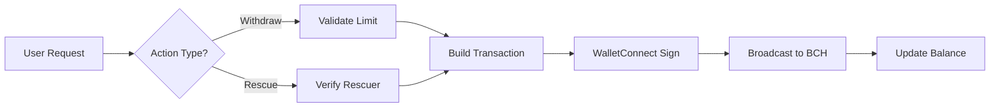

<div align="center">
  
  
  # 🏰 FortressVault
  
  ### Your Bitcoin Cash Self-Custody Solution with Built-in Protection
  
  [](https://opensource.org/licenses/MIT)
  [](https://cashscript.org/)
  [](https://nextjs.org/)
  
  **[Live Demo](https://fortressvault.vercel.app/) | [Documentation](#features) | [Smart Contract](packages/contracts/FortressVault.cash)**
</div>

---


---

## 🎯 What is FortressVault?

FortressVault is a **non-custodial Bitcoin Cash (BCH) smart contract vault** that brings the security philosophy of cold wallets to your everyday spending wallet. It's designed for users who want the convenience of a hot wallet with the peace of mind of having safety limits.

### The Problem We Solve

💸 **Hot wallets are vulnerable** - One compromised device or malicious dApp can drain your entire balance  
🥶 **Cold wallets are inconvenient** - Moving funds in emergencies requires physical access to your hardware wallet  
⚖️ **No middle ground exists** - Until now

### The FortressVault Solution

✅ **Withdrawal Limits** - Set a maximum amount that can be withdrawn in a single transaction  
✅ **Emergency Rescue** - Designate a cold wallet that can sweep all funds instantly if compromised  
✅ **On-Chain Rules** - Your security settings are enforced by Bitcoin Cash smart contracts, not servers  
✅ **Fully Non-Custodial** - You hold your keys. We never have access to your funds

---

## ⚡ Key Features

### 🛡️ **Smart Contract Security**
Built on CashScript, FortressVault uses Bitcoin Cash's native smart contract capabilities to enforce withdrawal rules at the protocol level. Your security policies are executed by the blockchain itself, making them tamper-proof and trustless.

### 🏭 **Zero-Cost Vault Creation**
Unlike EVM chains where deploying a smart wallet costs gas, FortressVault uses a **deterministic client-side factory pattern**. Creating a vault is completely free; the contract address is calculated mathematically off-chain and the contract only comes into existence on the blockchain when funded.

### 🎮 **Dual-Wallet Architecture**
- **Owner Wallet (Hot)**: Your daily driver for regular withdrawals within limits
- **Rescuer Wallet (Cold)**: Emergency override that can sweep all funds, bypassing limits

### 📜 **On-Chain Registry**
Vault configurations are permanently recorded on-chain using `OP_RETURN` outputs. This means:
- Your vault rules survive browser cache clears
- No centralized database can be hacked
- Verifiable transparency for all vault operations

### 💎 **WalletConnect v2 Integration**
Connect seamlessly with popular Bitcoin Cash wallets:
- Paytaca
- Cashonize
- Any WalletConnect-compatible BCH wallet

### 🔄 **Automatic Balance Tracking**
Real-time vault balance monitoring using Electrum network providers. Always know exactly how much is protected.

---

## 🚀 How It Works

### 1️⃣ **Create Your Vault**
```typescript
// Define your security parameters
const withdrawalLimit = 10000; // satoshis
const rescuerAddress = "bchtest:qp..."; // Your cold wallet

// Deploy the smart contract
const vault = createVault(ownerPkh, rescuerPkh, withdrawalLimit);
```

### 2️⃣ **Fund Your Vault**
Send BCH to your vault address. The contract enforces rules on every withdrawal.

### 3️⃣ **Withdraw Within Limits**
Use your hot wallet to withdraw up to your configured limit anytime. The smart contract validates:
- ✅ Signature matches owner
- ✅ Amount ≤ withdrawal limit
- ✅ Change returns to vault
- ✅ Output structure matches covenant

### 4️⃣ **Emergency Rescue**
If your hot wallet is compromised, connect your cold rescuer wallet and sweep all funds instantly, bypassing all limits.

---

## 🏗️ Technical Architecture

### Smart Contract (`FortressVault.cash`)
```plaintext
contract FortressVault(
    bytes20 ownerPkh,      // Hot wallet public key hash
    bytes20 rescuerPkh,    // Cold wallet public key hash  
    int limitAmount        // Maximum withdrawal per tx
)

Functions:
- withdraw(pk, sig, amount) → Limited spending
- rescue(pk, sig) → Emergency sweep
```

**Key Constraints:**
- Withdrawals require exactly 2 outputs (payment + change to vault)
- Introspection Covenants: Utilizes tx.outputs and lockingBytecode introspection to mathematically enforce that the change output MUST return to the exact same contract, preserving the security rules indefinitely.
- Rescue function has no output restrictions

### Frontend Stack
- **Next.js 16** - React framework with App Router
- **TailwindCSS** - Utility-first styling
- **@bch-wc2** - WalletConnect v2 integration for BCH
- **CashScript SDK** - Contract interaction layer
- **mainnet-js** - BCH utilities and Electrum provider

### Transaction Flow


---

## 🔧 Project Structure

```
bchtt/
├── packages/
│   ├── contracts/              # CashScript smart contracts
│   │   ├── FortressVault.cash  # Main vault contract
│   │   ├── artifacts/          # Compiled contract ABIs
│   │   └── test/               # Contract test suite
│   │
│   └── dapp/                   # Next.js frontend
│       ├── src/
│       │   ├── app/            # App router pages
│       │   ├── components/     # React components
│       │   │   └── FortressVault.tsx  # Main vault UI
│       │   └── hooks/          # Custom React hooks
│       └── public/
│           └── fortress-logo.svg  # Branding assets
│
├── package.json                # Monorepo root
└── README.md                   # You are here
```

---

## 🎨 User Interface

### Dashboard Features
- **Real-time Balance Display** - See your vault balance in BCH/SATS
- **Withdrawal Controls** - Input amount with unit conversion (BCH ↔ SATS)
- **Limit Enforcement** - Visual feedback when exceeding limits
- **Registry Status** - On-chain indicator showing vault is registered
- **Edit Rules** - Create new vault with updated parameters
- **Emergency Panel** - Red-themed rescue interface with wallet verification

### Security Indicators
- 🟢 **On-Chain Badge** - Confirms vault rules are recorded
- 🔒 **Rescuer Verification** - PKH matching before rescue operations
- ⚠️ **Limit Warnings** - Clear visual feedback on constraint violations

---

## 🛠️ Installation & Setup

### Prerequisites
- Node.js 18+ and Yarn
- Bitcoin Cash testnet (Chipnet) wallet
- WalletConnect Project ID (Optional - [get one free](https://cloud.walletconnect.com/))

### Quick Start

```bash
# Clone the repository
git clone https://github.com/furkngld/fortressvault.git
cd fortressvault

# Install dependencies
yarn install

# Configure environment variables
cd packages/dapp
cp .env.example .env.local
# Add your WalletConnect Project ID to .env.local (Optional)

# Build contracts
yarn workspace @dapp-starter/contracts build

# Start development server
yarn workspace @dapp-starter/dapp dev
```

Visit `http://localhost:3000` and connect your Chipnet wallet!

---

## 🧪 Testing

```bash
# Run contract tests
yarn workspace @dapp-starter/contracts test

# Run with coverage
yarn workspace @dapp-starter/contracts test --coverage
```

Test suite includes:
- ✅ Withdrawal limit enforcement
- ✅ Covenant output structure validation
- ✅ Rescue operation permissions
- ✅ PKH verification logic
- ✅ Fee calculation scenarios

---

## 📊 Use Cases

### 1. **Daily Spending Protection**
Set a $100 daily withdrawal limit. Even if your phone is stolen, attackers can only drain $100 at a time.

### 2. **Business Treasury**
Company hot wallet with $10,000 limit for operational expenses. CFO's cold wallet can rescue everything if compromised.

### 3. **Family Inheritance**
Parent holds owner key, trusted family member holds rescuer key. Regular withdrawals limited, but family can access in emergencies.

### 4. **DeFi Safety Net**
Interact with experimental DApps using a limited vault. Your main stack stays safe in cold storage.

---

## 🔐 Security Considerations

### ✅ What's Protected
- Limits enforced by blockchain consensus
- No single point of failure (no servers)
- Rescuer key offline in cold storage
- Open source and auditable

### ⚠️ What to Know
- Testnet only (Chipnet) - not production ready
- Smart contracts are immutable once deployed
- Always test with small amounts first
- Keep rescuer seed phrase extremely secure

---

## 🗺️ Roadmap

- [ ] Mainnet deployment
- [ ] Time-locked withdrawals (cooldown periods)
- [ ] Multi-signature rescuer support
- [ ] Mobile-optimized PWA
- [ ] Transaction history dashboard
- [ ] Automated security alerts
- [ ] Integration with hardware wallets

---

## 🤝 Contributing

We welcome contributions! Areas where help is needed:

- 🐛 Bug reports and fixes
- 📝 Documentation improvements
- 🎨 UI/UX enhancements
- 🔒 Security audits
- 🌐 Translations

**Development Workflow:**
1. Fork the repository
2. Create a feature branch (`git checkout -b feature/amazing-feature`)
3. Make your changes with tests
4. Run `yarn test` to verify
5. Submit a Pull Request

---

## 📄 License

This project is licensed under the **MIT License** - see the [LICENSE](LICENSE) file for details.

---

## 🙏 Acknowledgments

Built with love using:
- [CashScript](https://cashscript.org/) - Bitcoin Cash smart contract language
- [mainnet-js](https://mainnet.cash/) - BCH JavaScript library
- [WalletConnect](https://walletconnect.com/) - Wallet connection protocol
- [Next.js](https://nextjs.org/) - React framework

Special thanks to the Bitcoin Cash developer community for creating the tools that make covenant contracts possible.

---

## 📞 Contact & Support

- **Issues**: [GitHub Issues](https://github.com/yourusername/bchtt/issues)
- **Discussions**: [GitHub Discussions](https://github.com/yourusername/bchtt/discussions)
- **Twitter**: [@YourHandle](https://twitter.com/yourhandle)

---

<div align="center">
  <strong>⚡ Built on Bitcoin Cash | 🔒 Secured by Smart Contracts | 💎 Owned by You</strong>
  
  <p>If you find FortressVault useful, give us a ⭐ on GitHub!</p>
</div>
