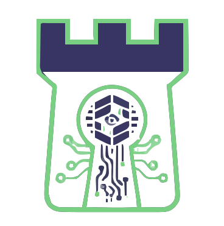
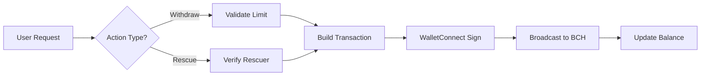

<div align="center">
  
  
  # 🏰 FortressVault
  
  ### Institutional-Grade Security for Your Personal Bitcoin Cash
  
  
  <br/><br/>

  [](https://opensource.org/licenses/MIT)
  [](https://cashscript.org/)
  [](https://nextjs.org/)
  
  **[Live Demo](https://fortressvault.vercel.app/) | [Documentation](#features) | [Smart Contract](packages/contracts/FortressVault.cash)**
</div>

---

<div align="center">
  
</div>

---

## 🎯 What is FortressVault?

FortressVault is a **non-custodial Bitcoin Cash (BCH) smart contract vault** that brings the security philosophy of cold wallets to your everyday spending wallet. It's designed for users who want the convenience of a hot wallet with the peace of mind of having unshakeable on-chain safety limits.

**Sleep soundly knowing your funds have a safety limit, even if your private key is stolen.**

### ♟️ The Hacker's Dilemma
Usually, if a hacker gets your private key, it's **Game Over**. They drain your funds in seconds.
**With FortressVault, the game changes:**

| Scenario | Standard Wallet 💀 | FortressVault 🛡️ |
| :--- | :--- | :--- |
| **Key Compromised** | Hacker has full access. | Hacker has key, but **ZERO** power to drain funds. |
| **Transfer Attempt** | Funds gone instantly. | **BLOCKED.** Transaction rejected by network rules. |
| **Outcome** | You lose everything. | You use **Panic Button**, move funds to cold storage. Hacker gets nothing. |

> *"FortressVault turns a catastrophic security breach into a minor inconvenience."*

---

## ⚡ Key Features

### 🧠 **Auto-Discovery Engine**
Forget about saving contract addresses or config files. FortressVault utilizes an **On-Chain Registry**.
*   **How it works:** When you connect your wallet, our dApp scans your transaction history on the Bitcoin Cash network.
*   **The Magic:** If you have created a rule before, we detect it instantly and load your vault interface. **Your settings live on the blockchain, not on our servers.**

### ❄️ **Cold Wallet Rescue Mode**
The ultimate failsafe. You can define a "Rescuer Address" (e.g., your Ledger or Trezor) when creating the vault.
*   **Scenario:** Your hot wallet is compromised.
*   **Action:** Connect your Rescuer Wallet to the dApp.
*   **Result:** The "Verify Rescuer" button activates, allowing you to **sweep 100% of funds** immediately, bypassing all withdrawal limits to save your assets.

### 🛡️ **Smart Contract Introspection**
Built on **CashScript**, utilizing Chipnet's advanced **Introspection Covenants**.
*   We mathematically enforce that any "change" (leftover funds) from a withdrawal **MUST** return to the exact same vault contract.
*   This ensures the security rules persist indefinitely, transaction after transaction.

### 🏭 **Zero-Cost Vault Creation**
*   Unlike EVM chains where deploying a smart wallet costs gas (e.g. Gnosis Safe), FortressVault uses a **deterministic client-side factory pattern**. Creating a vault is completely free; the contract exists mathematically and is only deployed when funded.
---

## 🚀 How It Works

### 1️⃣ **Create Your Vault**
Define your safety rules. The app broadcasts a registry signal to the blockchain.
```typescript
// On-Chain Registry Signal
OP_RETURN ["FV1", limitHex, rescuerPkh]
```

### 2️⃣ **Fund & Forget**
Send BCH to your generated vault address. Your funds are now protected by the covenant.

### 3️⃣ **Daily Spending**
Withdraw funds up to your limit (e.g., 0.1 BCH).
*   **If amount ≤ Limit:** Transaction Approved ✅
*   **If amount > Limit:** Transaction Rejected by Network ❌

### 4️⃣ **Emergency Rescue**
Login with your Rescuer Wallet to override the protocol and retrieve everything.

---

## 🏗️ Technical Architecture

### 🚫 No Database, No Backend, No Risk
Competitors often rely on centralized backends to index smart contract events. FortressVault is purely client-side.
*   **Resilience:** Zero downtime risk.
*   **Privacy:** No user data collected.
*   **Trust:** Verify everything on-chain.

### Smart Contract (`FortressVault.cash`)
```plaintext
contract FortressVault(
    bytes20 ownerPkh,      // Hot wallet public key hash
    bytes20 rescuerPkh,    // Cold wallet public key hash  
    int limitAmount        // Maximum withdrawal per tx
)
```

**Key Constraints:**
- **Withdrawals:** Require exactly 2 outputs (payment + persistent change).
- **Covenants:** Uses `tx.outputs` and `lockingBytecode` to prevent funds from "leaking" out of the vault rules.
- **Rescue:** Uses signature verification of the `rescuerPkh` to unlock full access.

### Frontend Stack
- **Next.js 16** - React framework with App Router
- **TailwindCSS** - Modern, glassmorphism UI
- **@bch-wc2** - WalletConnect v2 integration for BCH
- **CashScript SDK** - Contract interaction & compilation
- **Electrum Network** - Real-time blockchain indexing

### Transaction Flow


---

## 🔧 Project Structure

```
fortressvault/
├── packages/
│   ├── contracts/              # CashScript smart contracts
│   │   ├── FortressVault.cash  # Main vault contract
│   │   ├── artifacts/          # Compiled contract ABIs
│   │   └── test/               # Contract test suite
│   │
│   └── dapp/                   # Next.js frontend
│       ├── src/
│       │   ├── app/            # App router pages
│       │   ├── components/     # React components
│       │   │   └── FortressVault.tsx  # Main vault UI
│       │   └── hooks/          # Custom React hooks
│       └── public/
│           └── fortress-logo.svg  # Branding assets
│
├── package.json                # Monorepo root
└── README.md                   # You are here
```

---

## 🛠️ Installation & Setup

### Prerequisites
- Node.js 18+ and Yarn
- Bitcoin Cash testnet (Chipnet) wallet (Cashonize or Paytaca recommended)
- WalletConnect Project ID (Optional - [get one free](https://cloud.walletconnect.com/))

### Quick Start

```bash
# Clone the repository
git clone https://github.com/furkngld/fortressvault.git
cd fortressvault

# Install dependencies
yarn install

# Start development server
yarn workspace @dapp-starter/dapp dev
```

Visit `http://localhost:3000` and connect your Chipnet wallet!

---

## 🧪 Testing

```bash
# Run contract tests
yarn workspace @dapp-starter/contracts test
```

Test suite includes:
- ✅ Withdrawal limit enforcement
- ✅ Covenant output structure validation
- ✅ Rescue operation permissions
- ✅ PKH verification logic

---

## 🔐 Security Considerations

### ✅ What's Protected
- **Theft protection:** Attackers can't drain your wallet even with your private key.
- **Serverless:** No single point of failure. We don't store your data.
- **Cold Storage Backup:** Your rescuer key stays offline until you really need it.

### ⚠️ What to Know
- **Testnet only (Chipnet):** This is a prototype for BCH Blaze 2025.
- **Self-Custody:** You are responsible for your Rescuer Key. If you lose both keys, funds are lost.

---

## 💡 Why This is the "Killer App" for Chipnet
While other chains rely on centralized "Smart Contract Wallets" that cost gas to deploy and can be censored, **FortressVault** leverages the unique power of **BCH's UTXO Model + Introspection**:

1.  **Serverless & Unstoppable:** The security rules are burned into the coins themselves (Covenants). No server can turn it off.
2.  **Stateful UTXOs:** We use Covenants to simulate state (daily limits) on a stateless blockchain.
3.  **User-Centric:** It hides complex crypto primitives behind a simple UI that anyone can understand.

---

## 🗺️ Future Roadmap

FortressVault is not just a hackathon entry; it is the MVP of a comprehensive security layer for the Bitcoin Cash ecosystem.

### **Phase 1: The Foundation (Completed ✅)**
*   **Core Protocol:** Functional Limit & Rescue covenants deployed on Chipnet.
*   **Zero-Cost Factory:** Client-side deterministic address generation.
*   **On-Chain Registry:** Serverless config storage via `OP_RETURN`.

### **Phase 2: Fortress Sentinel (Q1 2026) 👁️**
*   **Intrusion Detection Dashboard:** A dedicated interface to visualize **failed withdrawal attempts**.
    *   *How:* We will index mempool rejection events associated with your vault address.
    *   *Value:* See exactly when, how much, and from where a hacker tried (and failed) to drain your wallet.
*   **Email/Telegram Alerts:** Get notified instantly: *"Blocked: Unauthorized attempt to withdraw 50 BCH."*

### **Phase 3: The "Legacy" Update (Q2 2026) ⏳**
*   **Dead Man's Switch (Inheritance):**
    *   If the vault sees no activity for `X` months, ownership automatically transfers to a designated heir (e.g., family member).
    *   *Tech:* Powered by `OP_CHECKSEQUENCEVERIFY` (Relative Time-locks).
*   **Time-Locked Allowances:** Set weekly or monthly limits (e.g., "1 BCH per week") instead of per-transaction limits.

### **Phase 4: Mainnet & Mobile (Q3 2026) 🚀**
*   **Mainnet Deployment:** Launching on BCH Mainnet immediately after the **Layla Upgrade** activation (May 2026).
*   **Mobile App:** A dedicated mobile experience acting as a 2FA for your high-value transactions.
*   **Hardware Integration:** Direct support for Ledger/Trezor as "Rescuer" signers within the UI.

---

## 🤝 Contributing

We welcome contributions! Areas where help is needed:
- 🐛 Bug reports and fixes
- 🎨 UI/UX enhancements
- 🔒 Security audits

**Development Workflow:**
1. Fork the repository
2. Create a feature branch
3. Submit a Pull Request

---

## 📄 License

This project is licensed under the **MIT License**.

---

## 🙏 Acknowledgments

Built with love using:
- [CashScript](https://cashscript.org/) - Bitcoin Cash smart contract language
- [mainnet-js](https://mainnet.cash/) - BCH JavaScript library
- [WalletConnect](https://walletconnect.com/) - Wallet connection protocol

Special thanks to the **Bitcoin Cash Node** developers for enabling Introspection Opcodes.

---

## 📞 Contact & Support

- **Issues**: [GitHub Issues](https://github.com/furkngld/fortressvault/issues)
- **Twitter**: [@furkngld](https://x.com/furkngld)

---

<div align="center">
  <strong>⚡ Built on Bitcoin Cash | 🔒 Secured by Smart Contracts | 💎 Owned by You</strong>
  <br/><br/>
  <p><i>If you find FortressVault useful, give us a ⭐ on GitHub!</i></p>
</div>
